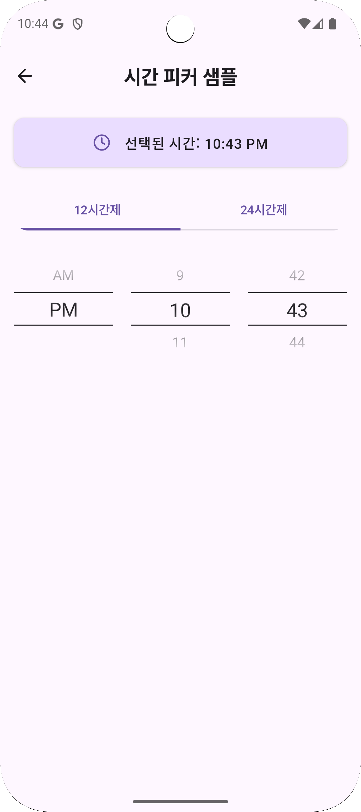
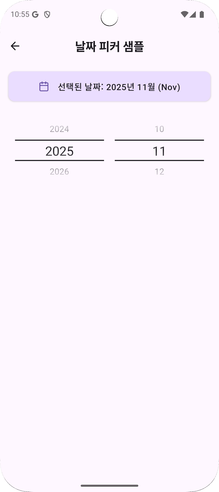

# Compose DateTimePicker

[](https://central.sonatype.com/artifact/io.github.kez-lab/compose-date-time-picker)
[](https://opensource.org/licenses/Apache-2.0)
[](http://kotlinlang.org)
[](https://github.com/JetBrains/compose-multiplatform)

A Compose Multiplatform date and time picker library that provides a consistent UI across Android, iOS, Desktop, and Web platforms.

[📝 Blog: Development Journey (Korean)](https://velog.io/@kej_ad/AndroidCompose-Year-Month-DatePicker-%EB%A7%8C%EB%93%A4%EA%B8%B0)

---

## 📱 Screenshots

### Sample Screens

<table>
  <tr>
    <td align="center">
      <br />
      <b>TimePicker Sample</b>
    </td>
    <td align="center">
      <br />
      <b>DatePicker Sample</b>
    </td>
  </tr>
</table>

### BottomSheet Integration

<table>
  <tr>
    <td align="center">
      <br />
      <b>BottomSheet Sample</b><br />
      <sub>Date and time selection in bottom sheet</sub>
    </td>
  </tr>
</table>

> **Demo**: The animation above shows the complete interaction flow for date and time selection using bottom sheets.

---

## ✨ Features

- 🌐 **Multiplatform**: Android, iOS, Desktop (JVM), and Web support
- ⏰ **TimePicker**: 12-hour and 24-hour format support
- 📅 **YearMonthPicker**: Year and month selection component
- 📱 **BottomSheet Ready**: Works seamlessly with Material3 ModalBottomSheet
- 🎨 **Fully Customizable**: Colors, fonts, sizes, visible item counts, and more
- 📐 **Responsive Layout**: Automatically adapts to screen sizes
- 🧩 **Compose Native**: Seamless integration with Jetpack Compose and Compose Multiplatform

### Why Use This Library?

- **Consistent UX**: Same design and behavior across all platforms
- **KMP Optimized**: Built on kotlinx-datetime for stable cross-platform operation
- **Extensible**: Build custom pickers using the provided base components

---

## 📦 Installation

### Gradle (Kotlin DSL)

```kotlin
dependencies {
    implementation("io.github.kez-lab:compose-date-time-picker:0.3.0")
}
```

### Platform Support

| Platform | Status | Minimum Version |
|----------|--------|-----------------|
| Android | ✅ Stable | API 24+ |
| iOS | 🧪 Beta | iOS 13+ |
| Desktop (JVM) | ✅ Stable | JVM 17+ |
| Web (JS) | ⚠️ Experimental | Modern browsers |

---

## 🚀 Quick Start

### 1. TimePicker (24-Hour Format)

```kotlin
import androidx.compose.runtime.*
import com.kez.picker.rememberPickerState
import com.kez.picker.time.TimePicker
import com.kez.picker.util.TimeFormat
import com.kez.picker.util.currentHour
import com.kez.picker.util.currentMinute

@Composable
fun TimePickerExample() {
    // Manage picker state
    val hourState = rememberPickerState(currentHour)
    val minuteState = rememberPickerState(currentMinute)

    Column(
        horizontalAlignment = Alignment.CenterHorizontally,
        modifier = Modifier.fillMaxWidth().padding(16.dp)
    ) {
        TimePicker(
            hourPickerState = hourState,
            minutePickerState = minuteState,
            timeFormat = TimeFormat.HOUR_24
        )

        Spacer(modifier = Modifier.height(16.dp))

        // Display selected time
        Text(
            text = "Selected: %02d:%02d".format(
                hourState.selectedItem,
                minuteState.selectedItem
            ),
            style = MaterialTheme.typography.titleLarge
        )
    }
}
```

### 2. TimePicker (12-Hour Format with AM/PM)

```kotlin
import com.kez.picker.util.TimePeriod

@Composable
fun TimePicker12HourExample() {
    // Convert current time to 12-hour format
    val hour12 = if (currentHour > 12) currentHour - 12
                 else if (currentHour == 0) 12
                 else currentHour
    val period = if (currentHour >= 12) TimePeriod.PM else TimePeriod.AM

    val hourState = rememberPickerState(hour12)
    val minuteState = rememberPickerState(currentMinute)
    val periodState = rememberPickerState(period)

    Column(
        horizontalAlignment = Alignment.CenterHorizontally,
        modifier = Modifier.fillMaxWidth().padding(16.dp)
    ) {
        TimePicker(
            hourPickerState = hourState,
            minutePickerState = minuteState,
            periodPickerState = periodState,
            timeFormat = TimeFormat.HOUR_12  // Enable 12-hour format
        )

        Spacer(modifier = Modifier.height(16.dp))

        Text(
            text = "%02d:%02d %s".format(
                hourState.selectedItem,
                minuteState.selectedItem,
                periodState.selectedItem  // AM or PM
            ),
            style = MaterialTheme.typography.titleLarge
        )
    }
}
```

### 3. YearMonthPicker

```kotlin
import com.kez.picker.date.YearMonthPicker
import com.kez.picker.util.currentDate

@Composable
fun YearMonthPickerExample() {
    // Using kotlinx-datetime (KMP standard)
    val yearState = rememberPickerState(currentDate.year)
    val monthState = rememberPickerState(currentDate.monthNumber)

    Column(
        horizontalAlignment = Alignment.CenterHorizontally,
        modifier = Modifier.fillMaxWidth().padding(16.dp)
    ) {
        YearMonthPicker(
            yearPickerState = yearState,
            monthPickerState = monthState
        )

        Spacer(modifier = Modifier.height(16.dp))

        Text(
            text = "Selected: ${yearState.selectedItem}/${monthState.selectedItem}",
            style = MaterialTheme.typography.titleLarge
        )
    }
}
```

### 4. BottomSheet Integration

```kotlin
import androidx.compose.material3.*

@OptIn(ExperimentalMaterial3Api::class)
@Composable
fun BottomSheetPickerExample() {
    var showBottomSheet by remember { mutableStateOf(false) }
    val sheetState = rememberModalBottomSheetState()
    val hourState = rememberPickerState(currentHour)
    val minuteState = rememberPickerState(currentMinute)
    val scope = rememberCoroutineScope()

    Button(onClick = { showBottomSheet = true }) {
        Text("Select Time")
    }

    if (showBottomSheet) {
        ModalBottomSheet(
            onDismissRequest = { showBottomSheet = false },
            sheetState = sheetState
        ) {
            Column(
                modifier = Modifier.fillMaxWidth().padding(16.dp),
                horizontalAlignment = Alignment.CenterHorizontally
            ) {
                TimePicker(
                    hourPickerState = hourState,
                    minutePickerState = minuteState,
                    timeFormat = TimeFormat.HOUR_24
                )

                Button(
                    onClick = {
                        scope.launch {
                            sheetState.hide()
                            showBottomSheet = false
                        }
                    }
                ) {
                    Text("Confirm")
                }
            }
        }
    }
}
```

---

## 📖 API Reference

### TimePicker Parameters

| Parameter | Type | Default | Description |
| --- | --- | --- | --- |
| `modifier` | `Modifier` | `Modifier` | Modifier to be applied to the composable |
| `hourPickerState` | `PickerState<Int>` | `rememberPickerState(currentHour)` | State for the hour picker |
| `minutePickerState` | `PickerState<Int>` | `rememberPickerState(currentMinute)` | State for the minute picker |
| `periodPickerState` | `PickerState<TimePeriod>?` | `null` | State for AM/PM picker (12-hour format only) |
| `timeFormat` | `TimeFormat` | `TimeFormat.HOUR_24` | Time format (`HOUR_12` or `HOUR_24`) |
| `startTime` | `LocalDateTime` | `currentDateTime` | Initial time value |
| `minuteItems` | `List<Int>` | `0..59` | List of minutes to display |
| `hourItems` | `List<Int>` | `1..12` (12-hour) / `0..23` (24-hour) | List of hours to display |
| `periodItems` | `List<TimePeriod>` | `[AM, PM]` | List of periods (12-hour format only) |
| `visibleItemsCount` | `Int` | `3` | Number of items visible at once |
| `itemPadding` | `PaddingValues` | `PaddingValues(8.dp)` | Padding for each item |
| `textStyle` | `TextStyle` | `TextStyle(fontSize = 16.sp)` | Text style for unselected items |
| `selectedTextStyle` | `TextStyle` | `TextStyle(fontSize = 22.sp)` | Text style for the selected item |
| `dividerColor` | `Color` | `LocalContentColor.current` | Color of the divider line |
| `fadingEdgeGradient` | `Brush` | (default gradient) | Gradient for fading edges |
| `dividerThickness` | `Dp` | `1.dp` | Thickness of the divider line |
| `pickerWidth` | `Dp` | `80.dp` | Width of each picker column |

### YearMonthPicker Parameters

| Parameter | Type | Default | Description |
| --- | --- | --- | --- |
| `modifier` | `Modifier` | `Modifier` | Modifier to be applied to the composable |
| `yearPickerState` | `PickerState<Int>` | `rememberPickerState(currentDate.year)` | State for the year picker |
| `monthPickerState` | `PickerState<Int>` | `rememberPickerState(currentDate.monthNumber)` | State for the month picker |
| `startLocalDate` | `LocalDate` | `currentDate` | Initial date value |
| `yearItems` | `List<Int>` | `1900..2100` | List of years to display |
| `monthItems` | `List<Int>` | `1..12` | List of months to display |
| `visibleItemsCount` | `Int` | `3` | Number of items visible at once |
| `itemPadding` | `PaddingValues` | `PaddingValues(8.dp)` | Padding for each item |
| `textStyle` | `TextStyle` | `TextStyle(fontSize = 16.sp)` | Text style for unselected items |
| `selectedTextStyle` | `TextStyle` | `TextStyle(fontSize = 24.sp)` | Text style for the selected item |
| `dividerColor` | `Color` | `LocalContentColor.current` | Color of the divider line |
| `fadingEdgeGradient` | `Brush` | (default gradient) | Gradient for fading edges |
| `dividerThickness` | `Dp` | `2.dp` | Thickness of the divider line |
| `pickerWidth` | `Dp` | `100.dp` | Width of each picker column |

### Custom Picker Extension

You can extend the library by using the `Picker` composable directly to create custom pickers:

```kotlin
@Composable
fun CustomPicker() {
    Picker(
        state = rememberPickerState(0),
        items = listOf("Option 1", "Option 2", "Option 3"),
        // ... customization parameters
    )
}
```

---

## 💻 Running the Sample Project

### Android

```bash
./gradlew :sample:installDebug
```

The app will be installed on your connected device or emulator.

### Desktop (JVM)

In Android Studio or IntelliJ IDEA:
1. Open `sample/src/desktopMain/kotlin/com/kez/picker/sample/Main.kt`
2. Click the run button next to the `main()` function

Or run via Gradle:
```bash
./gradlew :sample:desktopRun -DmainClass=com.kez.picker.sample.MainKt --quiet
```

### iOS

Open the `iosApp/` project in Xcode and run.

### Web

Build and serve the web application:
```bash
./gradlew :sample:jsBrowserRun
```

---

## 🤝 Contributing

Contributions are welcome! Whether it's bug reports, feature requests, or code contributions, we appreciate your help.

### How to Contribute

1. Fork this repository
2. Create a feature branch (`git checkout -b feature/amazing-feature`)
3. Commit your changes (`git commit -m 'Add some amazing feature'`)
4. Push to the branch (`git push origin feature/amazing-feature`)
5. Open a Pull Request

For bugs or feature requests, please use [GitHub Issues](https://github.com/kez-lab/Compose-DateTimePicker/issues).

---

## 📁 Project Structure

```text
Compose-DateTimePicker/
├── datetimepicker/                # Library module
│   └── src/
│       ├── commonMain/            # Shared code
│       │   └── kotlin/com/kez/picker/
│       │       ├── date/          # Date pickers (YearMonthPicker)
│       │       ├── time/          # Time pickers (TimePicker)
│       │       └── util/          # Utilities (currentHour, currentDate, etc.)
│       ├── androidMain/           # Android platform implementation
│       ├── iosMain/               # iOS platform implementation
│       ├── desktopMain/           # Desktop (JVM) platform implementation
│       └── jsMain/                # Web (JS) platform implementation
└── sample/                        # Sample application
    └── src/
        ├── commonMain/            # Shared sample code
        ├── androidMain/           # Android entry point
        ├── iosMain/               # iOS entry point
        ├── jvmMain/               # Desktop entry point
        └── jsMain/                # Web entry point
```

---

## 📄 License

```
Copyright 2024 KEZ Lab

Licensed under the Apache License, Version 2.0 (the "License");
you may not use this file except in compliance with the License.
You may obtain a copy of the License at

   http://www.apache.org/licenses/LICENSE-2.0

Unless required by applicable law or agreed to in writing, software
distributed under the License is distributed on an "AS IS" BASIS,
WITHOUT WARRANTIES OR CONDITIONS OF ANY KIND, either express or implied.
See the License for the specific language governing permissions and
limitations under the License.
```

---

## 🙏 Acknowledgements

Special thanks to all contributors and the Compose Multiplatform community.

If you find this library helpful, please consider giving it a ⭐️ on GitHub!
