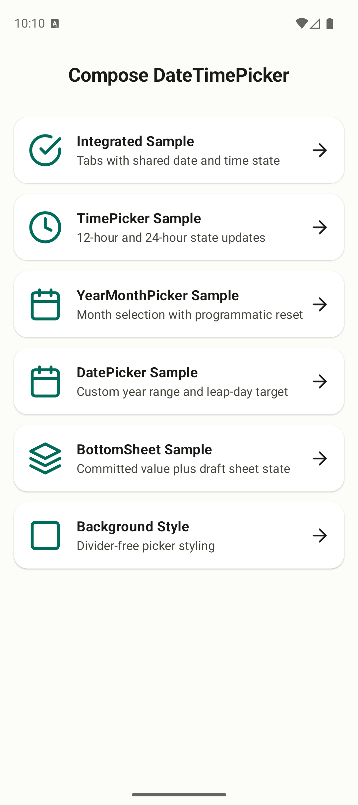
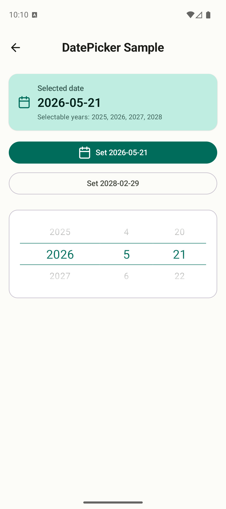
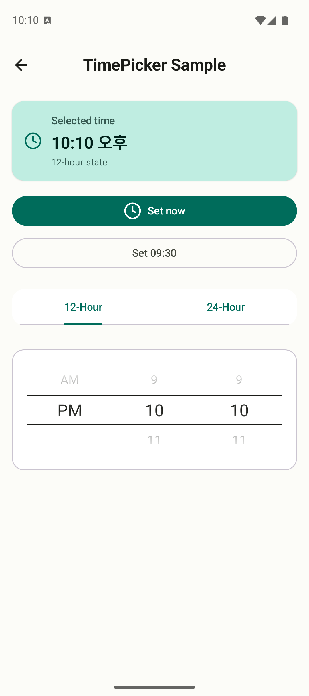
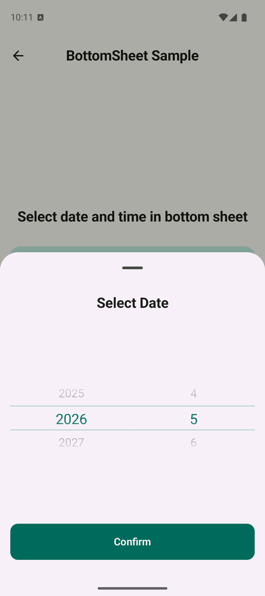

# Compose DateTimePicker

[](./README.md)

Compose Multiplatform을 위한 범용적이고 커스터마이징 가능한 날짜 및 시간 선택 라이브러리입니다.
Android, iOS, Desktop (JVM), Web (Wasm) 등 다양한 플랫폼에서 일관된 UI 컴포넌트를 제공합니다.

## 주요 기능

*   **멀티플랫폼 지원**: Android, iOS, Desktop (JVM), Web (Wasm) 환경을 지원하며 원활한 통합이 가능합니다.
*   **TimePicker**: 12시간(오전/오후) 및 24시간 형식을 모두 지원합니다.
*   **DatePicker**: 연도, 월, 일을 함께 선택하고 월/윤년에 맞춰 일을 자동 보정합니다.
*   **YearMonthPicker**: 년도와 월을 선택할 수 있는 전용 컴포넌트를 제공합니다.
*   **커스터마이징**: 재사용 가능한 UI 설정을 위한 `PickerStyle`과 format 옵션을 제공합니다.
*   **상태 관리**: `rememberTimePickerState`, `rememberDatePickerState`, `rememberYearMonthPickerState`를 통해 간편하게 상태를 관리할 수 있습니다.
*   **접근성**: 스크린 리더 및 내비게이션 지원 등 접근성을 고려하여 설계되었습니다.

## 샘플 앱

이 저장소에는 날짜, 시간, bottom sheet 흐름을 실제 앱 형태로 확인하고 복사해 활용할 수 있는 Compose Multiplatform 샘플 앱이 포함되어 있습니다.

<p align="center">
  
  
  
  
</p>

## 설치 방법

버전 카탈로그 또는 빌드 파일에 의존성을 추가하여 사용할 수 있습니다.

### 버전 카탈로그 (libs.versions.toml)

```toml
[versions]
composeDateTimePicker = "0.4.0"

[libraries]
compose-date-time-picker = { module = "io.github.kez-lab:compose-date-time-picker", version.ref = "composeDateTimePicker" }
```

### Gradle (build.gradle.kts)

```kotlin
dependencies {
    implementation("io.github.kez-lab:compose-date-time-picker:0.4.0")
}
```

> **릴리스 상태:** `0.4.0`이 현재 Maven Central/GitHub Releases에 공개된 최신 버전입니다. 이 README는 `main` 기준으로 유지되며 아직 릴리스되지 않은 `0.6.0` API 작업도 문서화하므로, 아래 사용법과 API 레퍼런스에는 `0.4.0`에 없는 API가 포함될 수 있습니다. 공개 버전 기준 API는 `0.4.0` release/tag 문서를 확인하세요. `main`을 로컬에서 테스트하려면 `./gradlew :datetimepicker:publishToMavenLocal`을 실행하고, 소비 프로젝트에 `mavenLocal()`을 추가한 뒤 `0.6.0`에 의존하세요.

릴리스 노트와 업그레이드 영향은 영문 [CHANGELOG.md](CHANGELOG.md)를 참고하세요.

## 사용법

> 아래 예제는 현재 `main` 브랜치 API를 기준으로 합니다. 위 설치 스니펫의 공개 `0.4.0` 의존성이 아니라, 아직 릴리스되지 않은 `0.6.0` API가 필요할 수 있습니다.

### State와 Callback 사용 패턴

`TimePicker`, `DatePicker`, `DateRangePicker`, `YearMonthPicker`는 `remember*State(...)`로 만든
picker state 객체를 composable에 전달해서 사용합니다. Picker UI 내부에서 현재 선택값의 단일 source of
truth는 이 state 객체입니다.

- 현재 값은 `state.selectedTime`, `state.selectedDate`, `state.selectedDateRange`,
  `state.selectedYearMonth`에서 읽습니다.
- 사용자 조작으로 바뀐 값을 앱 state, `ViewModel`, form data에 반영해야 할 때만 `onSelected*Change`를
  사용합니다.
- 앱이 버튼, preset, 외부 값 변경으로 `state.select*`를 직접 호출할 때는 `onSelected*Change`가 호출되지
  않습니다. 이 경우 같은 이벤트 핸들러 안에서 `state.select*(...)`와 앱이 소유한 값 갱신을 함께 수행하세요.
- picker를 reset하려고 `remember*State`를 새로 만들지 마세요. 기존 state 객체를 유지하고 public
  `select*` 메서드를 호출합니다.

### TimePicker

시간 선택을 위해 `TimePicker`를 사용합니다. 12시간 및 24시간 형식을 지원합니다.

#### 1. 24시간 형식

```kotlin
import androidx.compose.runtime.Composable
import androidx.compose.runtime.remember
import com.kez.picker.time.TimePicker
import com.kez.picker.time.rememberTimePickerState
import com.kez.picker.util.TimeFormat
import com.kez.picker.util.currentDateTime

@Composable
fun TimePicker24hExample() {
    val initialTime = remember { currentDateTime().time }
    val state = rememberTimePickerState(
        initialTime = initialTime,
        timeFormat = TimeFormat.HOUR_24
    )

    TimePicker(
        state = state,
        onSelectedTimeChange = { selectedTime ->
            // 앱 state, ViewModel, form data를 여기서 갱신합니다.
        }
    )

    // 앱 로직에 전달할 때는 state.selectedTime을 사용합니다.
}
```

#### 2. 12시간 형식 (오전/오후)

```kotlin
import androidx.compose.runtime.Composable
import androidx.compose.runtime.remember
import com.kez.picker.time.TimePicker
import com.kez.picker.time.rememberTimePickerState
import com.kez.picker.util.TimeFormat
import com.kez.picker.util.currentDateTime

@Composable
fun TimePicker12hExample() {
    // 12시간 형식 변환은 이제 state 내부에서 처리됩니다.
    val initialTime = remember { currentDateTime().time }
    val state = rememberTimePickerState(
        initialTime = initialTime,
        timeFormat = TimeFormat.HOUR_12
    )

    TimePicker(
        state = state
    )

    // state.selectedTime은 항상 kotlinx.datetime.LocalTime입니다.
}
```

#### 3. 시간 범위 제한

폼에서 특정 시간 범위만 허용해야 한다면 `PickerDefaults.timePickerItems(minTime = ..., maxTime = ...)`를
사용하세요. 같은 `items` 객체로 state를 만들면 복원값이나 preset 값이 picker가 렌더링되기 전에 가장
가까운 선택 가능 시간으로 보정됩니다.

```kotlin
import androidx.compose.runtime.Composable
import androidx.compose.runtime.remember
import com.kez.picker.PickerDefaults
import com.kez.picker.time.TimePicker
import com.kez.picker.time.rememberTimePickerState
import kotlinx.datetime.LocalTime

@Composable
fun BusinessHoursTimePickerExample() {
    val items = remember {
        PickerDefaults.timePickerItems(
            minuteItems = listOf(0, 15, 30, 45),
            minTime = LocalTime(8, 0),
            maxTime = LocalTime(18, 0)
        )
    }
    val state = rememberTimePickerState(
        items = items,
        initialHour = 7,
        initialMinute = 30
    )

    TimePicker(
        state = state,
        items = items
    )
}
```

### DatePicker

연도, 월, 일을 함께 선택할 때 `DatePicker`를 사용합니다. 선택된 월에 유효하지 않은 일이 있으면 자동으로 보정됩니다.

```kotlin
import androidx.compose.runtime.Composable
import androidx.compose.runtime.remember
import com.kez.picker.PickerDefaults
import com.kez.picker.date.DatePicker
import com.kez.picker.date.rememberDatePickerState
import com.kez.picker.util.currentDate
import kotlinx.datetime.LocalDate
import kotlinx.datetime.number

@Composable
fun DatePickerExample() {
    val initialDate = remember { currentDate() }
    val minDate = remember(initialDate.year) {
        LocalDate(initialDate.year, 1, 1)
    }
    val maxDate = remember(initialDate.year) {
        LocalDate(initialDate.year + 1, 12, 31)
    }
    val selectableYears = remember(minDate.year, maxDate.year) {
        (minDate.year..maxDate.year).toList()
    }
    val selectableDays = remember(initialDate.day) {
        listOf(1, 15, initialDate.day).distinct().sorted()
    }
    val items = remember(selectableYears, selectableDays, minDate, maxDate) {
        PickerDefaults.datePickerItems(
            yearItems = selectableYears,
            dayItems = selectableDays,
            minDate = minDate,
            maxDate = maxDate
        )
    }
    val state = rememberDatePickerState(
        items = items,
        initialYear = initialDate.year,
        initialMonth = initialDate.month.number,
        initialDay = initialDate.day
    )

    DatePicker(
        state = state,
        onSelectedDateChange = { selectedDate ->
            // 앱 state, ViewModel, form data를 여기서 갱신합니다.
        },
        items = items
    )

    // 앱 로직에 전달할 때는 state.selectedDate를 사용합니다.
}
```

`PickerDefaults.*Items(...)`로 선택 가능한 목록이나 날짜 범위를 제한할 때는 기억된 초기값 또는
복원된 state 값이 해당 규칙 안에 들어가도록 함께 설계하세요. 첫 composition 전에 보정해야 한다면
`rememberDatePickerState(items = items, initialDate = value)` 또는
`rememberDatePickerState(items = items, initialYear = year, initialMonth = month, initialDay = day)`를
사용하세요. composition 이후 외부 날짜가 바뀐다면 새 초기값 인자에 의존하지 말고
`state.selectDate(newDate, items)` 또는 `state.selectDate(year, month, day, items)`를 호출하세요.

### DateRangePicker

사용자가 시작일과 종료일을 순서가 보장된 범위로 선택해야 한다면 `DateRangePicker`를 사용합니다.

```kotlin
import androidx.compose.runtime.Composable
import androidx.compose.runtime.remember
import com.kez.picker.PickerDefaults
import com.kez.picker.date.DateRange
import com.kez.picker.date.DateRangePicker
import com.kez.picker.date.rememberDateRangePickerState
import com.kez.picker.util.currentDate
import kotlinx.datetime.LocalDate

@Composable
fun DateRangePickerExample() {
    val today = remember { currentDate() }
    val todayRange = remember(today) {
        DateRange(startDate = today, endDate = today)
    }
    val items = remember(today.year) {
        PickerDefaults.datePickerItems(
            yearItems = listOf(today.year),
            minDate = LocalDate(today.year, 1, 1),
            maxDate = LocalDate(today.year, 12, 31)
        )
    }
    val state = rememberDateRangePickerState(
        items = items,
        initialDateRange = todayRange
    )

    DateRangePicker(
        state = state,
        items = items,
        onSelectedDateRangeChange = { selectedRange: DateRange ->
            // 앱 state, ViewModel, form data를 여기서 갱신합니다.
        }
    )
}
```

### YearMonthPicker

특정 연도와 월을 선택할 때 `YearMonthPicker`를 사용합니다.

```kotlin
import androidx.compose.runtime.Composable
import androidx.compose.runtime.remember
import com.kez.picker.PickerDefaults
import com.kez.picker.date.YearMonth
import com.kez.picker.date.YearMonthPicker
import com.kez.picker.date.rememberYearMonthPickerState
import com.kez.picker.util.currentDate

@Composable
fun YearMonthPickerExample() {
    val initialYearMonth = remember { YearMonth.from(currentDate()) }
    val minYearMonth = initialYearMonth
    val maxYearMonth = remember {
        YearMonth(year = initialYearMonth.year + 1, month = initialYearMonth.month)
    }
    val items = remember {
        PickerDefaults.yearMonthPickerItems(
            minYearMonth = minYearMonth,
            maxYearMonth = maxYearMonth
        )
    }
    val state = rememberYearMonthPickerState(
        items = items,
        initialYearMonth = initialYearMonth
    )

    YearMonthPicker(
        state = state,
        items = items,
        onSelectedYearMonthChange = { selectedYearMonth: YearMonth ->
            // 앱 state, ViewModel, form data를 여기서 갱신합니다.
        }
    )

    // state.selectedYearMonth는 YearMonth(year, month)입니다.
    // state.selectedMonthDate는 LocalDate 연동이 필요할 때 사용할 수 있습니다.
}
```

### BottomSheet 통합

Picker 컴포넌트는 `ModalBottomSheet`나 다른 다이얼로그 컴포넌트 내에서도 원활하게 작동합니다.
확정된 값과 sheet 내부의 임시 picker state를 분리하면, sheet를 닫거나 취소했을 때 앱 상태가
의도치 않게 바뀌지 않습니다.

```kotlin
import androidx.compose.foundation.layout.Arrangement
import androidx.compose.foundation.layout.Column
import androidx.compose.foundation.layout.Row
import androidx.compose.foundation.layout.fillMaxWidth
import androidx.compose.foundation.layout.padding
import androidx.compose.material3.Button
import androidx.compose.material3.ExperimentalMaterial3Api
import androidx.compose.material3.ModalBottomSheet
import androidx.compose.material3.OutlinedButton
import androidx.compose.material3.Text
import androidx.compose.material3.rememberModalBottomSheetState
import androidx.compose.runtime.Composable
import androidx.compose.runtime.getValue
import androidx.compose.runtime.mutableIntStateOf
import androidx.compose.runtime.mutableStateOf
import androidx.compose.runtime.remember
import androidx.compose.runtime.rememberSaveable
import androidx.compose.runtime.setValue
import androidx.compose.ui.Modifier
import androidx.compose.ui.unit.dp
import com.kez.picker.time.rememberTimePickerState
import com.kez.picker.time.TimePicker
import kotlinx.datetime.LocalTime

@OptIn(ExperimentalMaterial3Api::class)
@Composable
fun BottomSheetPickerExample() {
    var committedHour by rememberSaveable { mutableIntStateOf(9) }
    var committedMinute by rememberSaveable { mutableIntStateOf(30) }
    var showBottomSheet by remember { mutableStateOf(false) }
    val sheetState = rememberModalBottomSheetState()
    val committedTime = LocalTime(committedHour, committedMinute)

    Column(verticalArrangement = Arrangement.spacedBy(12.dp)) {
        Text("선택된 시간: $committedTime")

        Button(onClick = { showBottomSheet = true }) {
            Text("시간 선택")
        }
    }

    if (showBottomSheet) {
        val draftState = rememberTimePickerState(initialTime = committedTime)

        ModalBottomSheet(
            onDismissRequest = { showBottomSheet = false },
            sheetState = sheetState
        ) {
            Column(
                modifier = Modifier
                    .fillMaxWidth()
                    .padding(24.dp),
                verticalArrangement = Arrangement.spacedBy(16.dp)
            ) {
                TimePicker(state = draftState)

                Row(
                    modifier = Modifier.fillMaxWidth(),
                    horizontalArrangement = Arrangement.spacedBy(8.dp)
                ) {
                    OutlinedButton(
                        onClick = { showBottomSheet = false },
                        modifier = Modifier.weight(1f)
                    ) {
                        Text("취소")
                    }

                    Button(
                        onClick = {
                            val selected = draftState.selectedTime
                            committedHour = selected.hour
                            committedMinute = selected.minute
                            showBottomSheet = false
                        },
                        modifier = Modifier.weight(1f)
                    ) {
                        Text("적용")
                    }
                }
            }
        }
    }
}
```

위 예제는 Android Activity 재생성에도 보존하기 쉽도록 primitive 값인 hour/minute를
`rememberSaveable`로 저장하고, draft picker state를 만들기 전에 `LocalTime`을 다시 생성합니다.

## API 레퍼런스

> 이 레퍼런스는 현재 `main` 브랜치 API를 설명합니다. 공개 `0.4.0` artifact에 의존하는 프로젝트에 예제를 복사하기 전에는 [CHANGELOG.md](CHANGELOG.md)와 `0.4.0` release/tag 문서를 확인하세요.

공개 state API는 해당 컴포넌트 패키지에 함께 둡니다. `TimePicker`, `TimePickerState`,
`rememberTimePickerState`는 `com.kez.picker.time`에 있고, `DatePicker`, `DatePickerState`,
`YearMonthPicker`, `YearMonthPickerState` 및 관련 `remember*State` 함수는
`com.kez.picker.date`에 있습니다.

format 옵션은 화면에 보이는 item text와 선택적인 접근성 값 설명을 한 곳에서 정의합니다.
item별 content description을 생략하면 picker는 화면에 보이는 텍스트를 접근성 값의 기본값으로
사용합니다. 이 동작은 화면 텍스트와 스크린 리더 값이 조용히 어긋나는 문제를 막지만, TalkBack이
"1시간", "1월", "오후"처럼 더 자연스럽게 읽어야 한다면 여전히 명시적인 설명을 제공해야 합니다.

semantics 옵션은 picker column label과 이전/다음 action label 같은 구조적 semantics를 정의합니다.
선택 상태는 고정된 영어 문구를 붙이지 않고 Compose `selected` semantics로 전달됩니다. 단일
`Picker<T>`에서는 `PickerDefaults.itemFormat(...)`를, composite picker value에는
`PickerDefaults.timePickerFormat(...)`, `datePickerFormat(...)`, `yearMonthPickerFormat(...)`를
사용하세요. 화면별 재사용 가능한 label/action 객체는 `PickerDefaults.semantics(...)`,
`timePickerSemantics(...)`, `datePickerSemantics(...)`, `yearMonthPickerSemantics(...)`로 만드세요.

```kotlin
TimePicker(
    state = state,
    format = PickerDefaults.timePickerFormat(
        hourItemText = { it.toString().padStart(2, '0') },
        minuteItemText = { it.toString().padStart(2, '0') },
        hourItemContentDescription = { "${it}시" },
        minuteItemContentDescription = { "${it}분" }
    ),
    semantics = PickerDefaults.timePickerSemantics(
        hourPickerLabel = "시간",
        minutePickerLabel = "분",
        previousItemActionLabel = "이전 항목 선택",
        nextItemActionLabel = "다음 항목 선택"
    )
)
```

### Generic Picker

단일 custom picker column이 필요하면 `Picker<T>`를 사용하세요.

```kotlin
import androidx.compose.runtime.Composable
import androidx.compose.runtime.getValue
import androidx.compose.runtime.mutableStateOf
import androidx.compose.runtime.rememberSaveable
import androidx.compose.runtime.setValue
import com.kez.picker.Picker
import com.kez.picker.PickerDefaults

@Composable
fun SizePickerExample() {
    val items = listOf("Small", "Medium", "Large")
    var selectedSize by rememberSaveable { mutableStateOf("Medium") }

    Picker(
        items = items,
        selectedItem = selectedSize,
        onSelectedItemChange = { selectedSize = it },
        enabled = true,
        isInfinity = false,
        format = PickerDefaults.itemFormat(
            itemText = { size -> size.uppercase() },
            itemContentDescription = { it }
        ),
        semantics = PickerDefaults.semantics(
            pickerLabel = "Size"
        )
    )
}
```

`Picker<T>`는 controlled component입니다. 선택값은 앱 state에 보관하고, 그 값을 `selectedItem`으로
전달하며, `onSelectedItemChange`에서 앱 state를 갱신하세요. `items`는 비어 있으면 안 되고 중복값이
없어야 하며, `selectedItem`은 반드시 `items` 안에 있어야 합니다. `items`가 바뀔 수 있다면 렌더링 전에
앱이 소유한 `selectedItem`을 새 목록의 값으로 갱신하거나 보정하세요. Picker가 composition 중일 때는
`items`를 불변 목록처럼 다루고, 선택 가능한 값이 바뀌면 새 목록을 만들어 전달하세요. `T`가 saveable하지 않다면 앱
state에는 saveable한 key를 저장한 뒤 렌더링 전에 그 key를 item으로 매핑하세요.
현재 값을 표시하되 사용자의 scroll, click, semantics 선택 action을 막아야 한다면 `enabled = false`를
전달하세요. Disabled picker는 기본 텍스트, divider, 선택 영역 배경에 `PickerDefaults.colors(...)`의
disabled 색상 슬롯을 사용합니다.

custom `content`는 `PickerItemScope<T>`를 받습니다. 따라서 custom row에서도 기본 formatted text,
selected/enabled 상태, distance fraction, text style, content color를 그대로 재사용할 수 있습니다.

```kotlin
Picker(
    items = items,
    selectedItem = selectedSize,
    onSelectedItemChange = { selectedSize = it },
    content = { item ->
        Text(
            text = if (item.isSelected) "[${item.text}]" else item.text,
            style = item.textStyle,
            color = item.contentColor
        )
    }
)
```

`style = PickerDefaults.style(...)`로 visible item count, 색상, 텍스트 스타일, divider, item padding,
선택 영역 배경, fading edge 동작을 하나의 재사용 가능한 객체로 커스터마이즈하세요.
화면에 보이는 텍스트와 스크린 리더 문구가 달라야 한다면 visible text는 `format.itemText`로, 접근성
값 설명은 `format.itemContentDescription`으로 분리하세요.

독립 실행형 `Picker`에서는 `dividerWidth`로 선택 divider의 길이를 제어할 수 있습니다.
`PickerDividerWidth.Fill`(기본값)은 column 전체 폭을 사용하고,
`PickerDividerWidth.Fraction(0f..1f)`은 column 폭의 비율을 사용하며,
`PickerDividerWidth.Fixed(Dp)`는 고정 폭을 사용합니다. divider는 가로 중앙에 배치됩니다.

```kotlin
Picker(
    items = items,
    selectedItem = selectedItem,
    onSelectedItemChange = { selectedItem = it },
    style = PickerDefaults.style(dividerWidth = PickerDividerWidth.Fraction(0.6f))
)
```

Composite picker(`TimePicker`, `DatePicker`, `YearMonthPicker`, `DateRangePicker`)는 column마다
divider를 따로 그리지 않고 picker 전체를 가로지르는 **단일 selection band**를 그립니다. 그래서 column
폭이나 column 간격이 달라도 selection line이 정렬됩니다. Composite picker의 선택 line은 per-column
`style` divider 설정이 아니라 `selectionIndicator`로 제어하세요. 기본 `selectionIndicator`는 `style`에서
파생되므로 기존 `dividerColor` / `dividerThickness` / `isDividerVisible` 커스터마이징은 계속 적용됩니다.
`horizontalInset`으로 picker 양쪽 가장자리에서 band를 안쪽으로 넣을 수 있습니다.

```kotlin
val style = PickerDefaults.style()
TimePicker(
    style = style,
    selectionIndicator = PickerDefaults.selectionIndicator(
        style = style,
        horizontalInset = 16.dp,
    ),
)
```

### 프로그래밍 방식 선택

`remember*State`로 picker state를 만들고 picker에 전달한 뒤, 이벤트 핸들러나
`LaunchedEffect(externalValue)`에서 공개 선택 메서드를 호출하세요. 선택값을 다시 맞추기 위해
state를 새로 만들 필요는 없습니다.

| State | Method |
| :--- | :--- |
| Generic `Picker<T>` | 앱이 소유한 `selectedItem` 값을 갱신 |
| `time.TimePickerState` | `selectTime(LocalTime(...))`, `selectTime(hour, minute)` 또는 대응되는 `items` overload |
| `date.DatePickerState` | `selectDate(LocalDate(...))`, `selectDate(year, month, day)` 또는 대응되는 `items` overload |
| `date.DateRangePickerState` | `selectDateRange(DateRange(...))`, `selectDateRange(startDate, endDate)`, `selectDateRange(startYear, startMonth, startDay, endYear, endMonth, endDay)`, `selectStartDate(...)`, `selectEndDate(...)` 또는 대응되는 `items` overload |
| `date.YearMonthPickerState` | `selectYearMonth(YearMonth(...))`, `selectYearMonth(year, month)`, `selectDate(LocalDate(...))`, 또는 대응되는 `items` overload |

```kotlin
import androidx.compose.foundation.layout.Column
import androidx.compose.material3.Button
import androidx.compose.material3.Text
import androidx.compose.runtime.Composable
import com.kez.picker.time.rememberTimePickerState
import com.kez.picker.time.TimePicker
import kotlinx.datetime.LocalTime

@Composable
fun ProgrammaticTimePickerExample() {
    val state = rememberTimePickerState(initialTime = LocalTime(8, 0))

    Column {
        Button(onClick = { state.selectTime(hour = 9, minute = 30) }) {
            Text("Set 09:30")
        }

        TimePicker(state = state)
    }
}
```

요청한 값이 현재 item list에 포함되어 있으면 picker 스크롤 위치가 동기화됩니다. custom list는 엄격하게
검증됩니다. 비어 있지 않아야 하고, 중복이 없어야 하며, 지원 범위 안의 값만 포함해야 하고, 현재 선택값도
반드시 포함해야 합니다. `TimePicker`는 선택적 `minTime`/`maxTime` 범위에 맞춰 시간, 분, 오전/오후
column을 필터링합니다. `DatePicker`는 `dayItems`를 선택된 연/월의 최대 일수로 필터링하고,
선택적 `minDate`/`maxDate` 범위도 함께 적용합니다. 앱이 custom list나 설정된 범위 밖의 값을 복원하거나
요청할 수 있다면 먼저 `items.contains(...)`로 primitive 또는 value 객체가 선택 가능한지 검사하고, 값을
보정해야 한다면 `state.select*(value, items)` overload나 `items.coerce*` helper로 가장 가까운 선택 가능
값으로 이동한 뒤 picker를 렌더링하세요.
첫 composition의 초기값에도 같은 보정이 필요하면 `remember*State(items = items, initial... = value)`를
사용하세요.

`onSelectedTimeChange`, `onSelectedDateChange`, `onSelectedDateRangeChange`,
`onSelectedYearMonthChange`는 사용자가 picker를 조작해서 값이 바뀔 때 호출됩니다. 프로그래밍 방식의
`state.select*` 호출은 state를 직접 변경하므로, 그 이벤트 핸들러 안에서 앱이 소유한 값도 함께
갱신하세요.

composite picker의 column 비율을 조정해야 한다면 `PickerDefaults.timePickerLayout(...)`,
`datePickerLayout(...)`, `yearMonthPickerLayout(...)`을 사용하세요. 특정 column의 weight를
`null`로 전달하면 그 column은 `pickerModifier`의 명시적 width를 사용할 수 있습니다. locale,
제품, form 규칙에 따라 month/day/year처럼 다른 순서가 필요하면 `columnOrder`를 사용하세요.

```kotlin
DatePicker(
    state = state,
    layout = PickerDefaults.datePickerLayout(
        columnOrder = listOf(
            DatePickerColumn.MONTH,
            DatePickerColumn.DAY,
            DatePickerColumn.YEAR
        )
    )
)
```

`columnOrder`는 각 column을 정확히 한 번씩 포함해야 합니다. `TimePicker`에서
`TimePickerColumn.PERIOD`는 12시간 형식에서만 렌더링되고 24시간 형식에서는 무시됩니다.

### TimePicker

| 파라미터 | 설명 | 기본값 |
| :--- | :--- | :--- |
| `state` | Picker를 제어하기 위한 상태 객체입니다. | `rememberTimePickerState()` |
| `onSelectedTimeChange` | 사용자 조작으로 선택된 `LocalTime`이 바뀐 뒤 호출됩니다. | `{}` |
| `enabled` | 사용자 scroll, click, semantics 선택 action을 허용할지 여부입니다. | `true` |
| `items` | 선택 가능한 분, 24시간제 시간, 12시간제 표시 시간, 오전/오후 목록과 선택적 `minTime`/`maxTime` 범위입니다. | `PickerDefaults.timePickerItems()` |
| `format` | 각 picker column의 화면 표시 텍스트와 선택적 접근성 값 설명입니다. | `PickerDefaults.timePickerFormat()` |
| `style` | 각 picker column의 시각/레이아웃 스타일입니다. | `PickerDefaults.style()` |
| `selectionIndicator` | picker 전체에 그려지는 공유 selection band입니다. | `PickerDefaults.selectionIndicator(style)` |
| `layout` | period, hour, minute picker column의 weight와 표시 순서입니다. 명시적 width가 필요한 column은 weight를 `null`로 설정하세요. | `PickerDefaults.timePickerLayout()` |
| `spacingBetweenPickers` | picker column 사이의 가로 간격입니다. | `0.dp` |
| `semantics` | 각 picker column의 접근성 label과 custom action label입니다. | `PickerDefaults.timePickerSemantics()` |

**TimePickerState 속성:**

- `selectedHour`: Picker에 표시되는 선택된 시간입니다.
- `selectedMinute`: 현재 선택된 분입니다. (0-59)
- `selectedPeriod`: 12시간 형식에서 선택된 오전/오후 값입니다.
- `selectedHourOfDay`: 선택된 시간을 24시간 기준(0-23)으로 변환한 값입니다.
- `selectedTime`: 선택된 값을 `kotlinx.datetime.LocalTime`으로 제공합니다.

`rememberTimePickerState`는 saveable state를 사용합니다. Android에서는 플랫폼 saveable registry가 제공될 때 Activity 재생성 이후에도 선택값을 복원할 수 있습니다.

초기값은 `rememberTimePickerState(initialTime = LocalTime(...))` 또는
`initialHour`/`initialMinute` 파라미터로 설정합니다. 초기 시간 또는 primitive parts를 첫 composition
전에 보정해야 한다면 같은 `items` 객체를 함께 전달하세요.

상태 생성 이후 선택값을 바꾸려면 `state.selectTime(LocalTime(...))` 또는
`state.selectTime(hour, minute)`을 호출합니다. custom item 목록이나 시간 범위를 함께 적용해야 한다면
`items`를 받는 overload를 사용하세요. 정수 `hour`는 `0..23` 범위의 hour-of-day로 해석됩니다.

custom item 값이 유효 범위를 벗어나거나, 중복이 있거나, 필수 목록이 비어 있거나, 현재 선택값이 custom 목록 또는 시간 범위 밖이면 composition 중 `IllegalArgumentException`이 발생합니다. custom item 목록은 picker에 전달한 뒤 불변으로 다루고, 선택 가능한 값이 바뀌면 새 `items` 객체를 만들어 전달하세요. 12시간 형식의 `PickerDefaults.timePickerItems(hour12Items = ...)`는 표시 시간 기준(`1..12`)입니다. 예를 들어 `initialHour = 13`은 `state.selectedHour == 1`, `PM`으로 변환됩니다.

### DatePicker

| 파라미터 | 설명 | 기본값 |
| :--- | :--- | :--- |
| `state` | Picker를 제어하기 위한 상태 객체입니다. | `rememberDatePickerState()` |
| `onSelectedDateChange` | 사용자 조작으로 선택된 `LocalDate`가 바뀐 뒤 호출됩니다. | `{}` |
| `enabled` | 사용자 scroll, click, semantics 선택 action을 허용할지 여부입니다. | `true` |
| `items` | 선택 가능한 연도/월/일 목록과 선택적 `minDate`/`maxDate` inclusive 범위입니다. 값은 `1000..9999`, `1..12`, `1..31` 범위여야 합니다. | `PickerDefaults.datePickerItems()` |
| `format` | 각 picker column의 화면 표시 텍스트와 선택적 접근성 값 설명입니다. | `PickerDefaults.datePickerFormat()` |
| `style` | 각 picker column의 시각/레이아웃 스타일입니다. | `PickerDefaults.style()` |
| `selectionIndicator` | picker 전체에 그려지는 공유 selection band입니다. | `PickerDefaults.selectionIndicator(style)` |
| `layout` | year, month, day picker column의 weight와 표시 순서입니다. 명시적 width가 필요한 column은 weight를 `null`로 설정하세요. | `PickerDefaults.datePickerLayout()` |
| `spacingBetweenPickers` | picker column 사이의 가로 간격입니다. | `0.dp` |
| `semantics` | 각 picker column의 접근성 label과 custom action label입니다. | `PickerDefaults.datePickerSemantics()` |

**DatePickerState 속성:**

- `selectedYear`: 현재 선택된 연도입니다.
- `selectedMonth`: 현재 선택된 월입니다. (1-12)
- `selectedDay`: 현재 선택된 일입니다. 선택된 월에 맞게 자동 보정됩니다.
- `selectedDate`: 선택된 값을 `kotlinx.datetime.LocalDate`로 제공합니다.
- `maxDay`: 현재 선택된 연도/월에서 선택 가능한 최대 일입니다.

`rememberDatePickerState`는 saveable state를 사용합니다. Android에서는 플랫폼 saveable registry가 제공될 때 Activity 재생성 이후에도 선택값을 복원할 수 있습니다.

초기값은 `rememberDatePickerState(initialDate = LocalDate(...))` 또는
`initialYear`/`initialMonth`/`initialDay` 파라미터로 설정합니다. 초기값 또는 primitive parts를 첫
composition 전에 보정해야 한다면 같은 `items` 객체를 함께 전달하세요. 초기 연도는 `1000..9999`,
월은 `1..12` 범위여야 하고 일은 최소 `1`이어야 합니다. `initialDay`가 초기 연/월의 최대 일수보다 크면
그 최대 일수로 보정됩니다.

상태 생성 이후 선택값을 바꾸려면 `state.selectDate(LocalDate(...))` 또는
`state.selectDate(year, month, day)`를 호출합니다. custom item 목록이나 날짜 범위를 함께 적용해야
한다면 `items`를 받는 overload를 사용하세요.

custom item 값이 유효 범위를 벗어나거나, 중복이 있거나, 목록이 비어 있거나, 현재 선택된 연도/월/일이 custom 목록 또는 날짜 범위 밖이면 composition 중 `IllegalArgumentException`이 발생합니다. custom item 목록은 picker에 전달한 뒤 불변으로 다루고, 선택 가능한 값이 바뀌면 새 `items` 객체를 만들어 전달하세요. 연/월 변경으로 현재 월 또는 일이 선택 불가능해지면 설정된 제약 안에서 가장 가까운 선택 가능 값으로 이동합니다.

### DateRangePicker

| 파라미터 | 설명 | 기본값 |
| :--- | :--- | :--- |
| `state` | 선택된 시작일과 종료일을 제어하는 상태 객체입니다. | `rememberDateRangePickerState()` |
| `onSelectedDateRangeChange` | 사용자 조작으로 선택된 `DateRange`가 바뀐 뒤 호출됩니다. | `{}` |
| `enabled` | 사용자 scroll, click, semantics 선택 action을 허용할지 여부입니다. | `true` |
| `items` | 공유되는 연도/월/일 선택 목록과 선택적 `minDate`/`maxDate` inclusive 범위입니다. | `PickerDefaults.datePickerItems()` |
| `format` | 각 picker column의 화면 표시 텍스트와 선택적 접근성 값 설명입니다. | `PickerDefaults.datePickerFormat()` |
| `style` | 각 picker column의 시각/레이아웃 스타일입니다. | `PickerDefaults.style()` |
| `selectionIndicator` | 각 child `DatePicker`에 그려지는 공유 selection band입니다. | `PickerDefaults.selectionIndicator(style)` |
| `layout` | 각 child `DatePicker`의 column weight와 표시 순서입니다. | `PickerDefaults.datePickerLayout()` |
| `spacingBetweenPickers` | 각 child `DatePicker` 내부 column 사이의 가로 간격입니다. | `0.dp` |
| `spacingBetweenDatePickers` | 시작/종료 child picker 사이의 세로 간격입니다. | `16.dp` |
| `startLabel` / `endLabel` | 각 child picker 위에 표시할 선택적 label입니다. | `"Start date"` / `"End date"` |
| `semantics` | 시작/종료 child picker의 접근성 label과 custom action label입니다. | `PickerDefaults.dateRangePickerSemantics()` |

`DateRangePickerState`는 `selectedStartDate <= selectedEndDate`를 항상 유지합니다. 사용자가 시작일을
현재 종료일 뒤로 이동하면 종료일도 같은 날짜로 이동하고, 종료일을 현재 시작일 앞으로 이동하면 시작일도
같은 날짜로 이동합니다.

초기값은 `rememberDateRangePickerState(initialDateRange = DateRange(...))`,
`rememberDateRangePickerState(initialStartDate = ..., initialEndDate = ...)`, 또는 명시적인
`initialStartYear`/`initialStartMonth`/`initialStartDay`와 대응되는 종료일 파라미터로 설정합니다.
상태 생성 이후 선택값을 바꾸려면 `DateRange`, `LocalDate`, 또는 명시적인 year/month/day 값을
사용해 `state.selectDateRange(...)`, `state.selectStartDate(...)`, `state.selectEndDate(...)`를
호출합니다.
`DateRange`도 명시적인 시작/종료 year, month, day 값으로 만들 수 있습니다. 앱의 시작/종료 field가
어느 순서로든 입력될 수 있다면 state에 전달하기 전에 `DateRange.ordered(startDate, endDate)` 또는
대응되는 year/month/day overload를 사용하세요. 앱이 form field 값을 `LocalDate`로 만들기 전에
inclusive range 포함 여부를 확인해야 한다면 `range.contains(year, month, day)`를 사용하세요.

### YearMonthPicker

| 파라미터 | 설명 | 기본값 |
| :--- | :--- | :--- |
| `state` | Picker를 제어하기 위한 상태 객체입니다. | `rememberYearMonthPickerState()` |
| `onSelectedYearMonthChange` | 사용자 조작으로 선택된 `YearMonth`가 바뀐 뒤 호출됩니다. | `{}` |
| `enabled` | 사용자 scroll, click, semantics 선택 action을 허용할지 여부입니다. | `true` |
| `items` | 선택 가능한 연도/월 목록과 선택적 `minYearMonth`/`maxYearMonth` 범위입니다. 값은 `1000..9999`와 `1..12` 범위여야 합니다. | `PickerDefaults.yearMonthPickerItems()` |
| `format` | 각 picker column의 화면 표시 텍스트와 선택적 접근성 값 설명입니다. | `PickerDefaults.yearMonthPickerFormat()` |
| `style` | 각 picker column의 시각/레이아웃 스타일입니다. | `PickerDefaults.style()` |
| `selectionIndicator` | picker 전체에 그려지는 공유 selection band입니다. | `PickerDefaults.selectionIndicator(style)` |
| `layout` | year, month picker column의 weight와 표시 순서입니다. 명시적 width가 필요한 column은 weight를 `null`로 설정하세요. | `PickerDefaults.yearMonthPickerLayout()` |
| `spacingBetweenPickers` | picker column 사이의 가로 간격입니다. | `0.dp` |
| `semantics` | 각 picker column의 접근성 label과 custom action label입니다. | `PickerDefaults.yearMonthPickerSemantics()` |

**YearMonthPickerState 속성:**

- `selectedYear`: 현재 선택된 연도입니다.
- `selectedMonth`: 현재 선택된 월입니다. (1-12)
- `selectedYearMonth`: 선택된 값을 `date.YearMonth`로 제공합니다.
- `selectedMonthDate`: 선택된 연/월을 해당 월의 1일 `LocalDate`로 제공합니다.

`rememberYearMonthPickerState`는 saveable state를 사용합니다. Android에서는 플랫폼 saveable registry가 제공될 때 Activity 재생성 이후에도 선택값을 복원할 수 있습니다.

초기값은 연/월 전용 선택에는 `rememberYearMonthPickerState(initialYearMonth = YearMonth(...))`를 우선 사용하세요. 날짜 API와 연동해야 한다면 `initialDate = LocalDate(...)`로 초기화할 수도 있고, `initialYear`/`initialMonth` 파라미터도 사용할 수 있습니다. 초기 연도는 `1000..9999` 범위여야 합니다.

상태 생성 이후 선택값을 바꾸려면 `state.selectYearMonth(YearMonth(...))`,
`state.selectYearMonth(year, month)`, 또는 `state.selectDate(LocalDate(...))`를 호출합니다.

custom item 값이 유효 범위를 벗어나거나, 중복이 있거나, 목록이 비어 있거나, 현재 선택된 연도/월이 custom 목록 또는 연/월 범위 밖이면 composition 중 `IllegalArgumentException`이 발생합니다. custom item 목록은 picker에 전달한 뒤 불변으로 다루고, 선택 가능한 값이 바뀌면 새 `items` 객체를 만들어 전달하세요. 연도 변경으로 현재 월이 선택 불가능해지면 가장 가까운 선택 가능 `YearMonth`로 이동합니다.

## 라이선스

```
Copyright 2024 KEZ Lab

Licensed under the Apache License, Version 2.0 (the "License");
you may not use this file except in compliance with the License.
You may obtain a copy of the License at

   http://www.apache.org/licenses/LICENSE-2.0

Unless required by applicable law or agreed to in writing, software
distributed under the License is distributed on an "AS IS" BASIS,
WITHOUT WARRANTIES OR CONDITIONS OF ANY KIND, either express or implied.
See the License for the specific language governing permissions and
limitations under the License.
```
